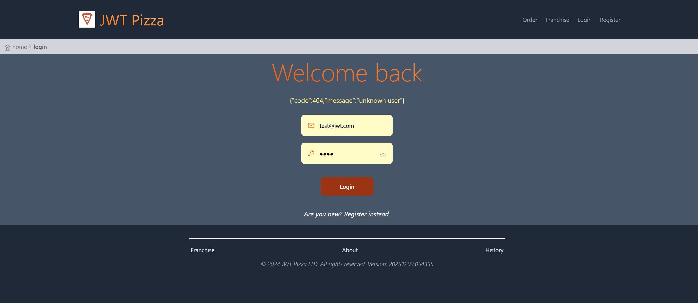

# Names
Damon Stevens & Corwyn Giles
# Self Attack
## Damon Stevens

| Item           | Result                                                                         |
| -------------- | ------------------------------------------------------------------------------ |
| Date           | December 3, 2025                                                               |
| Target         | pizza.cs329blaze.click                                                         |
| Classification | Broken Access Control                                                          |
| Severity       | 2                                                                              |
| Description    | Authentication and user role are not checked for getting a list of franchises  |
| Corrections    | Add auth and role checking to api/franchise/get so only admins can see a list of franchises                              |

| Item           | Result                                                                         |
| -------------- | ------------------------------------------------------------------------------ |
| Date           | December 3, 2025                                                               |
| Target         | pizza.cs329blaze.click                                                         |
| Classification | Broken Access Control                                                          |
| Severity       | 2                                                                              |
| Description    | User role is not checked for getting a list of users  |
| Corrections    | Add role checking to api/user/get so only admins can list users                  |

| Item           | Result                                                                         |
| -------------- | ------------------------------------------------------------------------------ |
| Date           | December 3, 2025                                                               |
| Target         | pizza.cs329blaze.click                                                         |
| Classification | Broken Access Control                                                          |
| Severity       | 4                                                                              |
| Description    | User role not checked when deleting a franchise, allowing anyone to delete one with the right endpoint                                |
| Corrections    | Add role checking to api/franchise/delete                                      |

| Item           | Result                                                                         |
| -------------- | ------------------------------------------------------------------------------ |
| Date           | December 3, 2025                                                               |
| Target         | pizza.cs329blaze.click                                                         |
| Classification | Cryptographic Failures                                                       |
| Severity       | 2                                                                             |
| Description    | User password sent in the response when registering a new user  |
| Corrections    | added method to sanitize user data when sending it                             |

| Item           | Result                                                                         |
| -------------- | ------------------------------------------------------------------------------ |
| Date           | December 3, 2025                                                               |
| Target         | pizza.cs329blaze.click                                                         |
| Classification | Sql injection                                                    |
| Severity       | 0                                                                            |
| Description    | Attempted to inject sql statements into querying for users and franchises. Did not have any effect.  |

| Item           | Result                                                                         |
| -------------- | ------------------------------------------------------------------------------ |
| Date           | December 5, 2025                                                               |
| Target         | pizza.cs329blaze.click                                                         |
| Classification | Sql injection                                                    |
| Severity       | 0                                                                            |
| Description    | Attempted to inject sql statements into the token with multiple requests. No effect  |
| Corrections| Sanitize inputs|

| Item           | Result                                                                         |
| -------------- | ------------------------------------------------------------------------------ |
| Date           | December 5, 2025                                                               |
| Target         | pizza.cs329blaze.click                                                         |
| Classification | Sql injection                                                    |
| Severity       | 0                                                                            |
| Description    | Attempted to inject sql statements into the username while logging in. Did not have any effect.  |

## Corwyn Giles

| Item           | Result                                                                         |
| -------------- | ------------------------------------------------------------------------------ |
| Date           | December 4th, 2025                                                                  |
| Target         | pizza.princecal.click                                                       |
| Classification | Identification and Authentication Failures                                                                      |
| Severity       | 4                                                                              |
| Description    | Admin Account Stolen.  All user data destroyed. List of user emails probably stolen.  Admin User Destroyed.             |
| Images         |    All Users have been destroyed. |
| Corrections    | Adjust Admin user so that the password is no longer admin.                                                       |

# Peer attack

## Damon Stevens' attack on Corwyn Giles

| Item           | Result                                                                         |
| -------------- | ------------------------------------------------------------------------------ |
| Date           | December 3, 2025                                                               |
| Target         | pizza.princecal.click                                                         |
| Classification | Broken Access Control                                                          |
| Severity       | 4                                                                              |
| Description    | User role not checked when deleting a franchise, allowing anyone to delete one with the right endpoint                                |
| Corrections    | Add role checking to api/franchise/delete                                      |
| Image| |

| Item           | Result                                                                         |
| -------------- | ------------------------------------------------------------------------------ |
| Date           | December 3, 2025                                                               |
| Target         | pizza.princecal.click                                                         |
| Classification | Broken Access Control                                                          |
| Severity       | 4                                                                              |
| Description    | User role not checked when deleting a user, allowing anyone to delete one with the right endpoint                                |
| Corrections    | Add role checking to api/user/delete                                      |
| Image |  |

| Item           | Result                                                                         |
| -------------- | ------------------------------------------------------------------------------ |
| Date           | December 5, 2025                                                               |
| Target         | pizza.cs329blaze.click                                                         |
| Classification | Sql injection                                                    |
| Severity       | 0                                                                          |
| Description    | Attempted to inject sql statements into the token with multiple requests. Injection failed  |

## Corwyn Giles' attack on Damon Stevens
| Item           | Result                                                                         |
| -------------- | ------------------------------------------------------------------------------ |
| Date           | December 5th, 2025                                                                  |
| Target         | pizza.cs329blaze.click                                                       |
| Classification | Injection                                                                     |
| Severity       | 0                                                                              |
| Description    | SQL Database Injection failed due to databaser rejecting multiple commands.            |
| Images         |    Admin access not granted |
| Corrections    | Adjust update users endpoint to no longer allow sql injection                                                      |

# Learnings
The main takeaway from this for me was how many vectors of attack there are that you need to be aware of when designing a service. You need to think outside of the box and be proactive in security, as if there is a hole in your security that you did not think of, hackers will find it and exploit it. I definitely understand why Cybersecurity is its own dedicated major, with how many scenarios there are for attacks. I also understand why every developer needs to be security minded though, as it is much easier to build a project which is secure than patch holes in security once they are discovered. 
